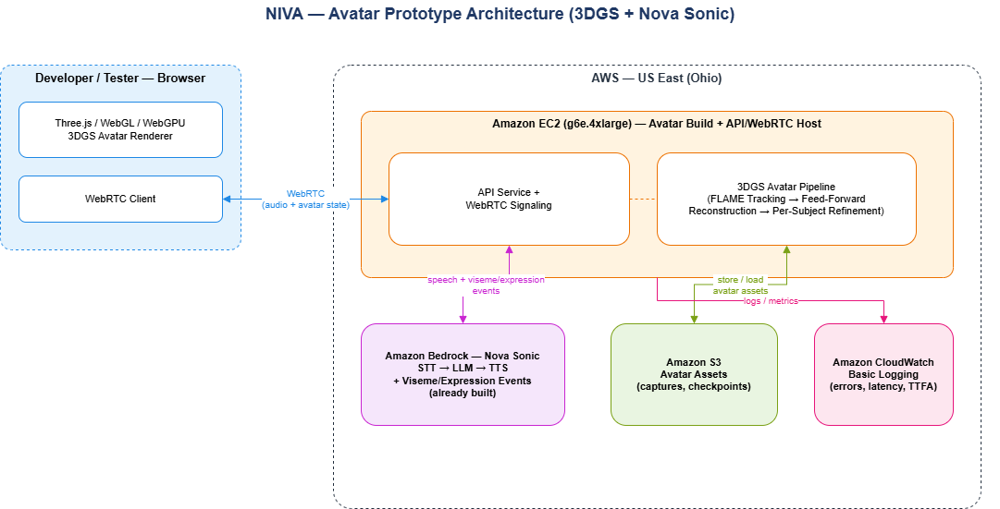

**Calyza Digital Employee — NIVA**

**Statement of Work — Avatar Creation Pipeline (Prototype)**

*3D Gaussian Splatting (3DGS) Avatar Method — Organization: Calyza Tech LLP*

# **Project Summary**

NIVA is a real-time conversational digital employee: a 3D avatar rendered in the browser, driven by a speech-to-speech AI pipeline. The conversational pipeline (speech understanding, reasoning, and speech generation via Amazon Bedrock Nova Sonic) is already built by the team. This document scopes the remaining piece: creating NIVA's 3D avatar with a 3D Gaussian Splatting (3DGS) method, and integrating it with Nova Sonic so a developer/tester can talk to it over WebRTC.

The browser renders the avatar using the client's GPU (WebGL/WebGPU). The backend never renders avatar video.

# **Business Purpose**

A consistent, always-available digital employee that interacts through natural voice and a realistic face, reducing manual support load without proportional headcount growth.

# **Solving Which Business Problem**

- Support/helpdesk deflection and knowledge access.
- A scalable digital workforce for repetitive conversational tasks.
- Natural voice + face interaction that improves engagement vs. text chatbots.

# **Success Criteria**

## **Technical**

- 3DGS avatar loads and renders in-browser; no server-side video rendering.
- Avatar animation binds cleanly to Nova Sonic's audio and viseme/expression events.
- Dev/host GPU instance stopped when not in use.

## **Performance**

- Time-to-first-audio < 1.5s.
- Stable frame rate for the client's hardware — up to ~60 FPS (High), ~30 FPS (Medium), 20–30 FPS (Low). Stable 30 FPS beats an unstable higher rate.

## **Functional**

- Developer/tester can speak to NIVA over WebRTC; Nova Sonic returns response audio and viseme/expression events.
- Avatar speaks in sync with audio; blinks; shows expressions and basic head/eye movement.

# **Target Customer Segment**

- Initial: enterprises and helpdesk teams needing consistent 24/7 first-line interaction.
- Near-term: HR, training, and education for knowledge access and onboarding.
- Future: hospitality, non-diagnostic healthcare info, sales/support — where data-handling constraints permit.

# **Scope**

## **In Scope**

- Single-subject avatar creation using a 3D Gaussian Splatting (3DGS) method (SpatialAvatar-0-style FLAME-mesh-bound Gaussian pipeline).
- Browser-based real-time rendering (Three.js / WebGL / WebGPU).
- Binding avatar animation (visemes, expressions, blinks, head/eye motion) to Nova Sonic.
- WebRTC connection so a single developer/tester can talk to the avatar.
- Single EC2 GPU instance for both avatar creation and hosting; S3 storage; basic CloudWatch logging.
- Cost estimate for this configuration.

## **Out of Scope**

- Server-side video rendering of the avatar.
- Self-hosted GPU inference for the speech pipeline.
- Multi-user / concurrent-session support.
- Regulated-domain decisioning (e.g. medical/legal advice).
- On-prem deployment, auto-scaling/load balancing, security hardening, and compliance controls.

# **Avatar Creation Method — 3D Gaussian Splatting (3DGS)**

The avatar uses a FLAME-mesh-bound 3D Gaussian representation instead of a traditional Blender modeling/retopology pipeline. Each Gaussian is bound to a triangle of the FLAME head mesh, so the avatar is driven directly by FLAME expression/pose/eye parameters — the same signal Nova Sonic emits as viseme/expression events.

Two stages:

- **Feed-forward reconstruction —** one forward pass over a few source portrait images produces a complete, animatable Gaussian avatar in ~50 ms.
- **Per-subject refinement —** a short optimization pass (~10K iterations, ~2 minutes) against a reference video adds subject-specific detail (skin, hair-edge, wrinkles) while keeping the FLAME binding fixed, so the avatar stays animation-ready.

This fits a capture-and-refine workflow inside a single prototype sprint, producing a rig that responds to FLAME codes for lipsync and facial animation.

# **Project Plan — Avatar Creation Timeline (4 Weeks)**

A single, unified four-week timeline. The Nova Sonic speech pipeline is already built and is not part of this timeline.

| Week | Focus | Key Activities |
| --- | --- | --- |
| **Week 1** | Capture & Setup | Capture source portrait(s)/reference video for the subject. Run FLAME tracking to recover shape, expression, and pose codes. Set up the 3DGS pipeline on the EC2 GPU instance (g6e.4xlarge). |
| **Week 2** | Feed-Forward Reconstruction | Generate the FLAME-mesh-bound Gaussian avatar via the feed-forward generator. Validate rendering quality against source images. Select the reference frame for refinement. |
| **Week 3** | Per-Subject Refinement | Run per-subject refinement against the reference video for subject-specific detail. Keep FLAME binding and Gaussian count frozen so the avatar stays animation-ready. QA across a few takes/lighting conditions. |
| **Week 4** | Export & Runtime Integration | Bind FLAME expression/pose/eye parameters to the browser renderer. Validate rendering across High/Medium/Low device tiers. Connect avatar animation to Nova Sonic's viseme/expression events. Internal demo with a developer/tester. |

# **Following Phase — Integration & Launch**

After the 4-week avatar build, the following work connects the avatar and Nova Sonic into a working prototype (no fixed schedule):

- Wire Nova Sonic (STT → LLM → TTS + viseme/expression events) end-to-end to the avatar renderer.
- WebRTC connection so a developer/tester can talk to the avatar; real-time sync testing.
- WebGPU → WebGL2 fallback validation on target devices.
- Runtime rendering-quality adaptation under load.
- Cost validation via the AWS Pricing Calculator.
- Deploy to EC2.

# **Development & Hosting Environment**

A single EC2 GPU instance (g6e.4xlarge) covers both roles: building the 3DGS avatar (capture processing, FLAME tracking, reconstruction, refinement) and hosting the API/WebRTC service that connects a developer/tester to it. Avatar rendering itself happens client-side in the browser, not on this instance.

# **Cost Management Philosophy**

Nova Sonic usage is expected to be the largest cost even at prototype scale. The GPU instance stays on-demand and always-on for now; stop/start is a future optimization. The service list is kept minimal for a single-user prototype.

# **Important Notes on This Estimate**

Only the Amazon EC2 (g6e.4xlarge) line is a verified export from the AWS Pricing Calculator. Every other line is an engineering estimate.

Nova Sonic bills on audio duration, a shape the AWS Pricing Calculator's Bedrock screen doesn't support (it only lists token-billed models). Its cost here remains an unconfirmed estimate.

*Dropped for this prototype: Fargate, ALB, Aurora, CloudFront, Secrets Manager, Route 53, CloudTrail, ElastiCache — the API/WebRTC service runs on the same single EC2 instance as the GPU pipeline; no managed DB, CDN, custom domain, or audit trail at this stage.*

# **Estimate Summary**

| Upfront Cost | Monthly Cost | Total 12 Months Cost |
| --- | --- | --- |
| 0.00 USD | 34,616.20 – 67,016.20 USD | 415,394.40 – 804,194.40 USD |

# **Detailed Estimate (Hour-wise)**

| Name | Group | Region | Hourly Cost (USD) | Monthly Cost (USD) |
| --- | --- | --- | --- | --- |
| Amazon EC2 (g6e.4xlarge) – Avatar Build + API/WebRTC | Compute | US East (Ohio) | 3.0043 | 2,193.10 |
| Amazon Bedrock – Nova Sonic | AI Pipeline | US East (Ohio) | 44.38 – 88.77 | 32,400.00 – 64,800.00 |
| Amazon S3 | Storage | US East (Ohio) | 0.0132 | 9.60 |
| Amazon CloudWatch (basic logging) | Observability | US East (Ohio) | 0.0185 | 13.50 |
| **TOTAL** |  |  | **47.42 – 91.81** | **34,616.20 – 67,016.20** |

*Row shaded green is verified via the AWS Pricing Calculator. All other rows are estimates pending calculator verification. For usage-billed services (Nova Sonic, S3), the hourly figure is the estimated monthly cost divided by 730 hours for comparability, not a real rate-card entry.*